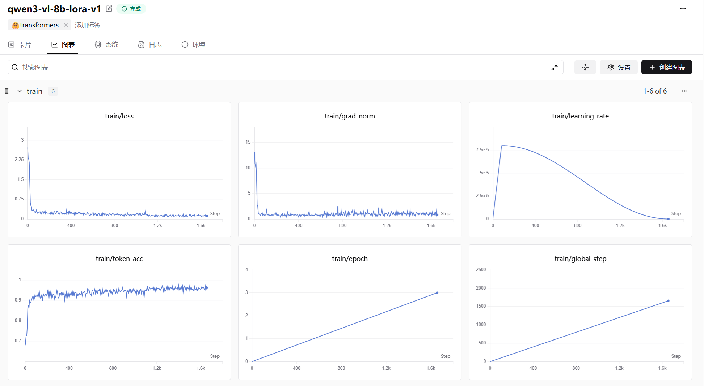
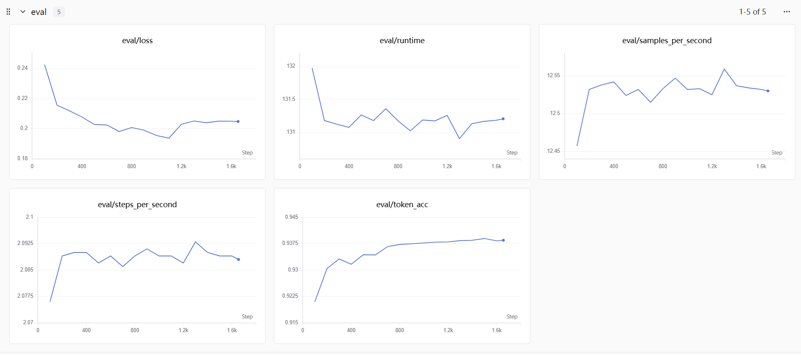

# 基于 Qwen3-VL 的证据约束金融财报多模态问答系统

[](https://www.python.org/downloads/)
[](https://pytorch.org/)
[](https://github.com/QwenLM/Qwen)

本项目旨在解决金融财报场景下复杂图表、长文本与密集数据交织导致的信息检索与问答难题。基于 **Qwen3-VL** 多模态大模型，我们构建了一个“证据约束”的端到端问答系统。它不仅能回答问题，更能提供精确的页面溯源和计算逻辑，确保金融场景下严苛的“可审计性”。

本项目**未依赖 LangChain 等第三方编排框架**，全链路从零手撕多模态 RAG Pipeline，并针对特定场景对 Qwen3-VL 进行了 LoRA 指令微调与严格多维量化评测，并最终封装为 WebUI 供端侧交互。

---

## ✨ 核心架构

区别于常规的“黑盒 QA”或简单的“图文对话”，本系统的核心设计理念是** “可审计与强约束” **。任务流被严密拆解为三层架构：

### 层 1：文档解析层 (Document Parsing)
* **核心动作**：页面 OCR、表格/图表/段落结构识别、页面级 Chunk 化、生成结构化表示。
* **技术实现**：充分利用 Qwen3-VL 强大的原生 document parsing 和 KIE（关键信息提取）能力，将非结构化的 PDF 财报无损转化为包含丰富视觉语义的结构化多模态切片。

### 层 2：证据检索层 (Evidence Retrieval)
* **核心动作**：从长篇幅多页财报中召回高度相关页，利用 Embedding + Reranker 进行双重精排。
* **技术实现**：采用 `Qwen3-VL-Embedding-4B/8B` 提取多模态特征进行初步粗排（Dense Retrieval）；利用微调后的 Qwen3-VL 作为交叉编码器（Cross-encoder Reranker）对 Top-K 进行细粒度重排，为最终生成层提供高信息密度的“证据包”。

### 层 3：证据生成问答层 (Evidence-Constrained Generation)
* **核心动作**：输出精确答案、输出证据页、输出引用片段/表项、输出计算步骤。
* **规则约束**：强制模型以规范的 JSON 格式输出，同时设定了**拒答机制**——当检索到的证据不足以支撑问题时，系统主动拒答，从根本上遏制金融数值幻觉。

---

## 🛠️ 大模型微调细节 (SFT Details)

针对金融图表理解与推理任务，我们使用 TAT-DQA 数据集构建了高质量的多模态指令微调数据集，并实施了高效参数微调。

* **数据格式转换**：为最大化适配 Qwen3-VL 官方推荐结构，将数据集统一转换为 `messages + images` 的 JSONL 格式。
* **架构认知与参数冻结策略**：
  * **策略**：冻结 ViT (视觉特征提取层) 和 Aligner (模态对齐层)，仅使用 LoRA 对 LLM 的全线性层 (`all-linear`) 进行微调。
  * **动机**：Qwen3-VL 预训练的 ViT 已经具备极强的 OCR 和页面布局理解能力，冻结它可以极大节省显存开销，同时让模型聚焦于学习复杂的“基于图表进行多步数值计算与 JSON 格式化输出”的逻辑。
* **核心超参数**：
  * `tuner_type`: lora (`rank=8`, `alpha=32`)
  * `torch_dtype`: bfloat16 (防溢出)
  * `learning_rate`: 1e-4 / `warmup_ratio`: 0.05
  * `gradient_checkpointing`: true (显存优化)
  * `IMAGE_MAX_TOKEN_NUM`: 1024 (限制单图 token 数，平衡分辨率与上下文长度)
  * 全局 Batch Size: 48 (单卡 bs=1 * 累加=8 * 6卡)

### 📈 训练曲线
<div align="center">
  
  <p><em>图：SwanLab 记录的 LoRA 微调 Loss 与 Learning Rate 等 曲线（训练平稳收敛，未出现过拟合）</em></p>
</div>

<div align="center">
  
  <p><em>图：SwanLab 记录的验证集上的 eval 曲线</em></p>
</div>

---

## 📊 多维量化评测结果 (Evaluation)

金融级系统不能仅看 ROUGE/BLEU。我们在验证集上基于严格的数值与逻辑约束设计了自定义量化指标：
* `answer_em`: 答案精确匹配率 (数值本身正确)
* `scale_em`: 量级精确匹配率 (单位如 thousand/million 判断正确)
* `joint_em`: 联合精确匹配率 (数值与量级**同时正确**才算对)
* `json_parse_rate`: 结构化 JSON 解析成功率

**Base 模型 vs Fine-tuned 模型效果对比 (示例数据)：**

| 评测指标 | Qwen3-VL-8B (Base) | Qwen3-VL-8B (LoRA SFT) | 绝对提升 |
| :--- | :---: | :---: | :---: |
| **JSON Parse Rate** | 82.5% | **99.2%** | 🚀 +16.7% |
| **Answer EM** | 41.2% | **76.5%** | 🚀 +35.3% |
| **Scale EM** | 58.0% | **88.1%** | 🚀 +30.1% |
| **Joint EM (核心指标)** | 36.5% | **73.8%** | 🚀 +37.3% |


---

## 🖥️ WebUI 系统交互展示

为了提供完整的工程交付体验，本系统基于 Gradio / Streamlit 构建了交互式 Web 界面。
* **特性**：支持用户直接上传 PDF 财报，输入自然语言提问；系统会分屏展示推理结果、完整的 JSON 解析树，并高亮溯源原始财报的对应页面与图表区块。

<div align="center">
  
  <p><em>图：基于 Qwen3-VL 的多模态 RAG WebUI 交互界面</em></p>
</div>

---

##  快速实现 (Quick Start)

### 1. 环境准备
```bash
pip install -r requirements.txt
# 核心依赖: transformers>=4.57.0, peft, datasets, accelerate
```
### 2. 模型微调 (SFT)
项目提供了两种微调启动方式：

方式 A: 基于 ms-swift 分布式微调 (推荐)

```Bash
bash swift_sft.sh
```
方式 B: 基于原生 Transformers + PEFT 的单/多卡微调

```Bash
python pure_transformers_qwen3_vl_sft.py \
  --model_name_or_path Qwen/Qwen3-VL-8B-Instruct \
  --train_file ./outputs/tatdqa_train_swift.jsonl \
  --eval_file ./outputs/tatdqa_dev_swift.jsonl \
  --output_dir ./outputs/qwen3_vl_8b_tatdqa_lora \
  --use_lora \
  --bf16 \
  --gradient_checkpointing
```
### 3. Task 1: 模型独立评测 (Compare Evaluation)
运行评测脚本，对比 Base 模型与 LoRA Adapter 模型在测试集上的量化指标差异：
```
Bash
python task1_compare_eval/run_compare_eval.py \
  --data_file ./outputs/tatdqa_test_swift.jsonl \
  --base_model Qwen/Qwen3-VL-8B-Instruct \
  --adapter_path ./outputs/qwen3_vl_8b_tatdqa_lora/checkpoint-xxx \
  --output_dir ./outputs/task1_compare_results
```
### 4. Task 2: 端到端多模态 RAG 流水线 (Pipeline)
你可以通过一步指令运行包含解析、索引、检索、重排和问答的全链路 Pipeline：

```Bash
python task2_rag/pipeline.py \
  --reports_dir ./financial_vl_system/apple_financial_rag_sample/reports \
  --questions_file ./financial_vl_system/apple_financial_rag_sample/questions/apple_2023_questions.jsonl \
  --work_dir /path/to/work_dir \
  --parse_model Qwen/Qwen3-VL-8B-Instruct \
  --embed_model Qwen/Qwen3-VL-Embedding-8B \
  --rerank_model Qwen/Qwen3-VL-8B-Instruct \
  --answer_adapter_path ./outputs/qwen3_vl_8b_tatdqa_lora/checkpoint-xxx
```
或者分步运行（对应 task2_rag/ 目录下的 doc_parser.py, build_index.py, dense_retriever.py, reranker.py, answerer.py）。